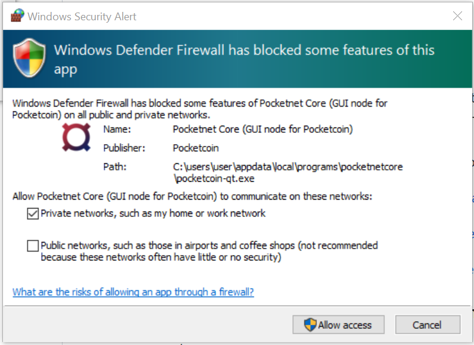
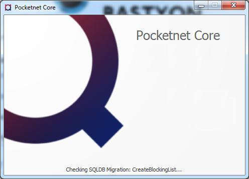
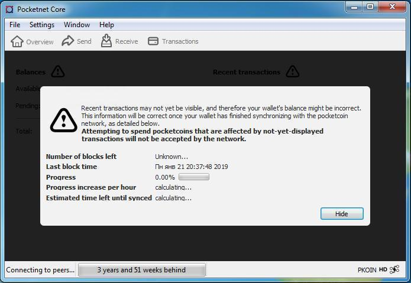
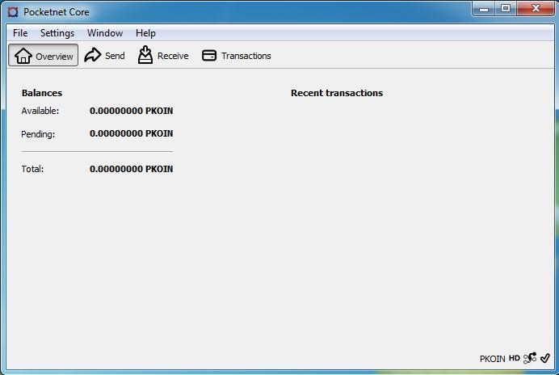

# Full Node Setup Guide

This guide provides instructions on how to set up a node to support the PocketNet blockchain network and the Bastyon decentralized social media app. PocketNet Core node operators are rewarded with the platform cryptocurrency, PKOIN, by participating in a process called staking, which generates new blocks on the blockchain. For more details about the PocketNet network, please refer to our whitepaper.

The Bastyon social media site can be accessed at [https://bastyon.com](https://bastyon.com)

<!--If you are editing System requirements section, please update other instances of System Requierements, mentioned in other parts of the documentation-->
## System Requirements

### Minimum Requirements

| Component | Specification |
|-----------|---------------|
| OS        | Windows 7 or higher (64 bit) / Linux (Debian, Ubuntu, Mint, etc.) (64 bit) |
| Processor | 2 core x86-64 CPU |
| RAM       | 4 GB |
| Internet  | 10 Mbit |
| Storage   | 150 GB* free SSD space for blockchain storage |

### Recommended Requirements

| Component | Specification |
|-----------|---------------|
| OS        | Windows 7 or higher (64 bit) / Linux (Debian, Ubuntu, Mint, etc.) (64 bit) |
| Processor | 4 core x86-64 CPU |
| RAM       | 12 GB |
| Internet  | - 100 Mbit <br/>- Publicly accessible IP address and ports (see Network Setup section) |
| Storage   | Same as minimum requirements |

## Additional Notes

1. **Storage Growth:** 
   - Disk space consumption may increase over time due to blockchain growth.

2. **Initial Synchronization:** 
   - Extra free space on the system disk and a large amount of RAM are required only during the first synchronization of the blockchain.

3. **Low RAM Troubleshooting:** 
   - If you have less RAM than recommended and the program closes automatically when you first start the node, increase the size of the paging file or swap file.

## Network Setup

For optimal performance as a public node, ensure:
- Your node has a publicly accessible IP address
- Necessary ports are open and properly configured (refer to network configuration documentation for specific port requirements)

## Linux Setup (Ubuntu, Debian, Mint, etc.)

1. Download the latest `pocketnetcore_*_linux_x64_setup.deb` package from the project [releases page](https://github.com/pocketnetteam/pocketnet.core/releases).

2. Install the package with root privileges. Open the terminal in the directory where you downloaded the installer and execute the command:

   ```bash
   $ sudo dpkg -i pocketnetcore_*_linux_x64_setup.deb
   ```

3. On Ubuntu and many Linux distributions, it's necessary to set the open files limit to 10000 to prevent errors. Run `ulimit -n` to view the current open file limit. Set the limit to 10000 open files with:

   ```bash
   $ ulimit -n 10000
   ```

4. After installation, start the GUI pocketcoin client from the command line:

   ```bash
   $ pocketcoin-qt
   ```

   (For running the PocketNet Core node from the command line or in headless mode, refer to the "Running a Headless Node from the Command Line" section later in this document.)

At this point, the PocketNet Core client will start synchronizing with the network. Depending on network performance, full synchronization can take anywhere from a few days to over a week to complete. If you need to bring a node up in a short period, you can download a checkpoint by following the instructions in the [Starting a Node From a Blockchain Snapshot](#starting-node-from-a-blockchain-snapshot) section below. However, it's recommended to allow a node to synchronize with the network on its own, as this validates the public blockchain and provides additional security and decentralization. During this time, the node unpacks the associated SQL database. You can track the unpacking process by monitoring the increase in the size of the working directory.

## Windows Setup

1. Download the `pocketnetcore_*_win_x64_setup.exe` installer from the GitHub [releases page](https://github.com/pocketnetteam/pocketnet.core/releases).

2. Run the installer and follow the instructions, changing the installation location if necessary.

3. Start the PocketNet Core application from the Windows Start menu. A Windows Security Alert will pop up for Windows Defender Firewall. Select "Allow access" to allow PocketNet Core through the Windows Defender Firewall for Private networks.

   

4. You will be prompted with a Setup Wizard:

   

   > **Important!** After installing the node program and launching it for the first time, you need to specify the path to the node's working directory!

5. Select "Use custom data directory" and specify the path to the node's working directory, then click OK.

   

6. The program will launch and begin indexing the database:

   

7. The PocketNet Core client will start synchronizing with the network. Depending on network performance, full synchronization can take anywhere from a few days to over a week to complete. For faster setup, you can download a checkpoint by following the instructions in the [Starting a Node From a Blockchain Snapshot](#starting-node-from-a-blockchain-snapshot) section below. However, it's recommended to allow a node to synchronize with the network on its own, as this validates the public blockchain and provides additional security and decentralization.

   

8. After synchronization, the main node window will launch:

   

## Docker Setup

Ensure that sufficient CPU, memory, and disk space are allocated to your Docker container according to the "Minimum System Requirements" section above. You can start your node with a single command from Docker:

```bash
$ docker run -d \
    --name=pocketnet.main \
    -p 37070:37070 \
    -p 38081:38081 \
    -p 8087:8087 \
    -v /var/pocketnet/.data:/home/pocketcoin/.pocketcoin \ 
    pocketnetteam/pocketnet.core:latest
```

The node can be controlled in Docker using the `pocketcoin-cli` and `pocketcoin-tx` commands:

```bash
$ docker ps --format '{{.ID}}\t{{.Names}}\t{{.Image}}'
ea7759a47250    pocketnet.main      pocketnetteam/pocketnet.core:latest

$ docker exec -it pocketnet.main /bin/sh

$ pocketcoin-cli --help
$ pocketcoin-tx --help
```

For more information, visit: https://hub.docker.com/r/pocketnetteam/pocketnet.core

## Starting Node from a Blockchain Snapshot

While it's recommended to allow a PocketNet Core node to sync with the blockchain on its own to maximize network security and decentralization, you can use a blockchain snapshot to bring up a node in a shorter time. The development team provides periodic archives of the blockchain, which can be downloaded from https://snapshot.pocketnet.app/latest.tgz.

> **Important:** Back up your wallet.dat file before attempting to load the blockchain from an archive.

Use the following Linux bash shell commands to delete the existing blockchain data on disk, download the blockchain archive, and extract it to the default location:

```bash
$ cd ~/.pocketcoin
$ rm -r blocks
$ rm -r chainstate
$ rm -r indexes
$ rm -r pocketdb
$ wget https://snapshot.pocketnet.app/latest.tgz
$ tar -xzf latest.tgz -C ./
```

## Running a Headless Node From the Command Line

To start PocketNet core in text-only mode from a command terminal, use the `pocketcoind` command. On Linux, you can launch pocketcoind as a daemon process running in the background by using the -daemon parameter:

```bash
$ pocketcoind -daemon
```

To see other available options with pocketcoind:

```bash
$ pocketcoind -?
```

You can send commands to pocketcoind using the pocketcoin-cli program. These same commands can also be run through the pocketcoin-qt debug terminal. Here are some common and useful commands:

- Display list of available commands:
  ```bash
  $ pocketcoin-cli help
  ```

- Get specific help on a command:
  ```bash
  $ pocketcoin-cli help "command"
  ```

- Gracefully shutdown the pocketcoind process:
  ```bash
  $ pocketcoin-cli stop
  ```

- Display your current balance of PKOIN:
  ```bash
  $ pocketcoin-cli getbalance
  ```

- Generate a new receive address with a descriptive "label":
  ```bash
  $ pocketcoin-cli getnewaddress "label"
  ```

- List previously generated or used receive addresses:
  ```bash
  $ pocketcoin-cli listreceivedbyaddress
  ```

- Send an amount of PKOIN to an address:
  ```bash
  $ pocketcoin-cli sendtoaddress "address" amount
  ```

- View a report of PKOINs won through staking:
  ```bash
  $ pocketcoin-cli getstakereport
  ```

- Check if your node is currently staking:
  ```bash
  $ pocketcoin-cli getstakinginfo
  ```

- View a list of connected peers:
  ```bash
  $ pocketcoin-cli getpeerinfo
  ```

Pocketcoin-cli has the capability to send commands to a remote node for remote management and headless node operation. This is an advanced topic beyond the scope of this guide; however, you can find necessary commands for remote operation by running `pocketcoin-cli --help`.

## Troubleshooting

If PocketNet Core fails, the first step is to check the debug.log file in the pocketcoin directory (`~/.pocketcoin` on Linux, `%HOMEPATH%\appdata\roaming\pocketcoin` on Windows). This file often provides clues about what went wrong with the program.

For help with node setup, post to the Bastyon/Pocknet tag on the Bastion social media app.

To connect with other node operators and keep up with developments and alerts, join the Node Owners chat on Bastyon. Message SnowflakeCrusher, Vortex_v, or Malaka on Bastyon to be added to the group.

To report software defects and view current issues, check our [GitHub issues page](https://github.com/pocketnetteam/pocketnet.core/issues).

## Contributions

We welcome contributions to our Github projects. We are looking for C/C++ and Javascript Node.js coders, as well as anyone with a willingness to learn. For more information, check out our [contributions'](/dev/contribution.md) documentation.