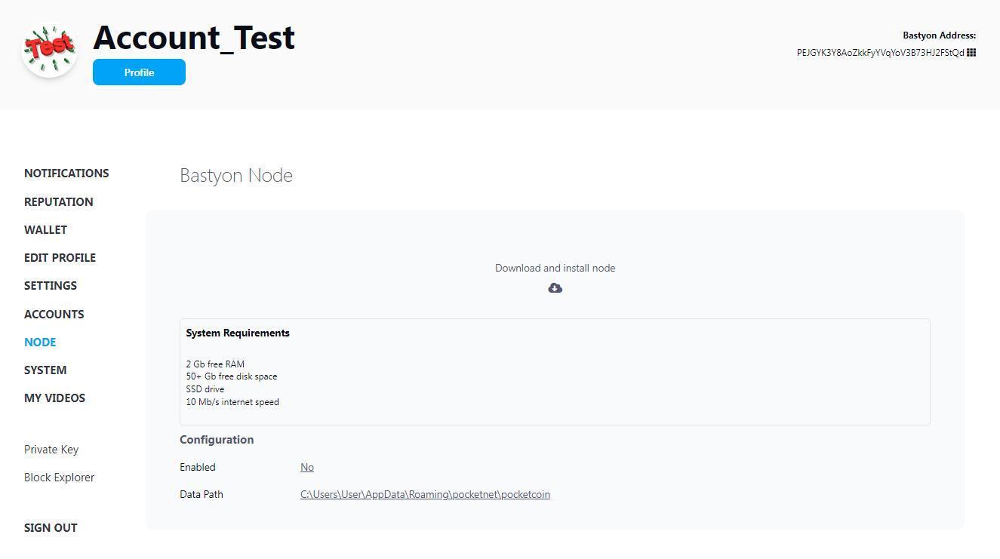
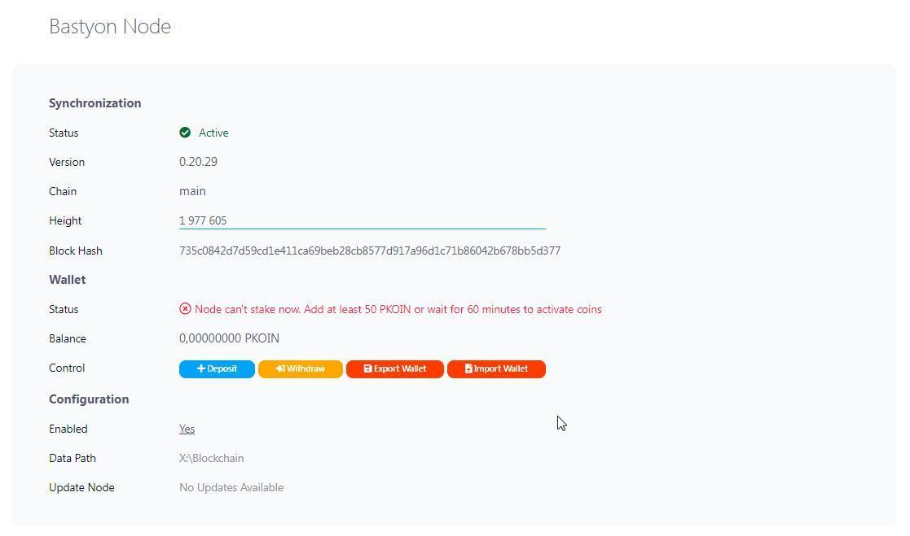

# Easy Node Setup Guide

## Important Notice

**Download and install Pocketnet Team software only from official sources!**

Official page on GitHub: [https://github.com/pocketnetteam](https://github.com/pocketnetteam)

## Download Links

Bastyon / Brighteon client application for personal computers (with Easy Node installation capability):
- GitHub: [https://github.com/pocketnetteam/pocketnet.gui/releases](https://github.com/pocketnetteam/pocketnet.gui/releases)

Download options:
- For Windows: BastyonSetup.exe
- For Linux: BastyonSetup.deb

> **Important Notes:**
> - The node has its own wallet and is not connected to the account
> - **Do not deposit Pocketcoin into your node wallet until you have fully configured your node and backed up your node wallet!**

## System Requirements

# Bastyon Node System Requirements Guide

## Overview

This guide outlines the system requirements for a Bastyon node that will function as a public node to service the Bastyon front end, including wallet and coin staking capabilities. 

> **Important Note:** Node requirements are subject to change as the network grows.

<!--If you are editing System requirements section, please update other instances of System Requierements, mentioned in other parts of the documentation-->
## System Requirements

### Minimum Requirements

| Component | Specification |
|-----------|---------------|
| OS        | Windows 7 or higher (64 bit) / Linux (Debian, Ubuntu, Mint, etc.) (64 bit) |
| Processor | 2 core x86-64 CPU |
| RAM       | 4 GB |
| Internet  | 10 Mbit |
| Storage   | 150 GB* free SSD space for blockchain storage |

### Recommended Requirements

| Component | Specification |
|-----------|---------------|
| OS        | Windows 7 or higher (64 bit) / Linux (Debian, Ubuntu, Mint, etc.) (64 bit) |
| Processor | 4 core x86-64 CPU |
| RAM       | 12 GB |
| Internet  | - 100 Mbit  - Publicly accessible IP address and ports (see Network Setup section) |
| Storage   | Same as minimum requirements |

## Additional Notes

1. **Storage Growth:** 
   - Disk space consumption may increase over time due to blockchain growth.

2. **Initial Synchronization:** 
   - Extra free space on the system disk and a large amount of RAM are required only during the first synchronization of the blockchain.

3. **Low RAM Troubleshooting:** 
   - If you have less RAM than recommended and the program closes automatically when you first start the node, increase the size of the paging file or swap file.

## Network Setup

For optimal performance as a public node, ensure:
- Your node has a publicly accessible IP address
- Necessary ports are open and properly configured (refer to network configuration documentation for specific port requirements)

## Installation Process

1. Install the Bastyon/Brighteon client (recommended in the default path).
2. Launch the client and create a new Bastyon account or log into an existing one.
3. To install and launch Easy Node, go to your account menu in the top right corner of the Bastyon / Brighteon home page.

4. Go to the menu (Management) - (Node).

5. Specify the directory for blockchain files storage (must be on an SSD, path in English only).
6. Click "Default Directory" to set the path, then "Download and install node".
7. The download of the database checkpoint and its further unzipping will begin.

8. The process of checking the database and starting synchronization with the network will begin.

> **Pay attention to the height:** First number = blocks on your node / Second number = blocks on the network

9. Wait for full network synchronization (indicated by matching blockchain heights).

## Using Easy Node

After installation and synchronization, the Easy Node window will display:

### Synchronization
- Status: active (Node is running)
- Version: [installed node version]
- Chain: main
- Height: [current block in the network]
- Block hash: [hash sum of the current block]

### Wallet
- Status: [Node status and staking status]
- Control options:
  - Deposit (Add Pocketcoin to node's wallet)
  - Transfer (Send Pocketcoin from node wallet)
  - Export wallet (Archive copy of wallet's private key)
  - Import wallet (Restore wallet using private key)

### Configuration
- Enabled: Turn node on/off
- Data path: Working directory of the node
- Node update: Available update version

> **Note:** After turning off the node, it becomes possible to delete the node and the working directory. **Attention!** Do not delete the node if you do not have an archived copy of the node's wallet.

## Important Wallet Management

**Before depositing Pocketcoin:**
1. Export the wallet's private key and save it securely.
2. Make a copy of the Wallet.dat file:
   - Turn off the node (Enabled - no)
   - Locate Wallet.dat in the node's working directory
   - Copy to multiple safe storage locations
   
> **Note:** Copy the wallet file only to a switched off node, otherwise it may be copied with an error.
> One backup of Wallet.dat and private key is sufficient (No need to make new backup copies after each transaction).

### Depositing Pocketcoin
1. Click "Deposit"
2. Use the displayed public address

> **Note:** A new public address is generated each time for privacy, but old addresses remain valid.

### Transferring Pocketcoin
1. Click "Transfer"
2. Provide transfer address, amount, and commission payer
3. Click "Send"